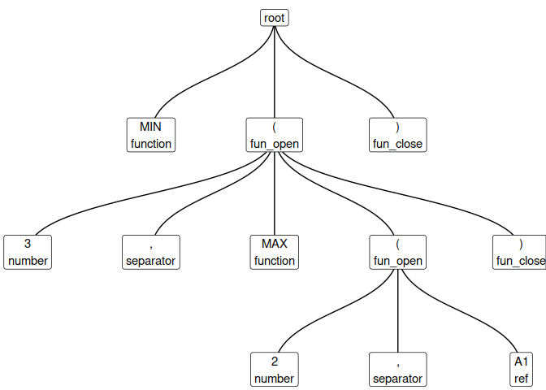

<!-- README.md is generated from README.Rmd. Please edit that file -->
tidyxl
======

[](https://travis-ci.org/nacnudus/tidyxl) [](https://ci.appveyor.com/project/nacnudus/tidyxl) [](https://cran.r-project.org/web/packages/tidyxl/index.html) [](https://www.r-pkg.org/pkg/tidyxl) [](https://codecov.io/gh/nacnudus/tidyxl)

[tidyxl](https://github.com/nacnudus/tidyxl) imports non-tabular data from Excel files into R. It exposes cell content, position, formatting and comments in a tidy structure for further manipulation, especially by the [unpivotr](https://github.com/nacnudus/unpivotr) package. It supports the xml-based file formats '.xlsx' and '.xlsm' via the embedded [RapidXML](http://rapidxml.sourceforge.net) C++ library. It does not support the binary file formats '.xlsb' or '.xls'.

It also provides a function `xlex()` for tokenizing formulas. See the [vignette](file:///home/nacnudus/R/tidyxl/docs/articles/smells.html) for details. It is useful for detecting 'spreadsheet smells' (poor practice such as embedding constants in formulas, or using deep levels of nesting), and for understanding the dependency structures within spreadsheets.

Mailing list
------------

For bugs and/or issues, create a new issue on [GitHub](https://github.com/nacnudus/tidyxl/issues) For other questions or comments, please subscribe to the [tidyxl-devel mailing list](https://groups.google.com/forum/#!forum/tidyxl-devel). You must be a member to post messages, but anyone can read the archived discussions.

Installation
------------

``` r
devtools::install_github("nacnudus/tidyxl")
```

Examples
--------

The package includes a spreadsheet, 'titanic.xlsx', which contains the following pivot table:

``` r
ftable(Titanic, row.vars = 1:2)
#>              Age      Child     Adult    
#>              Survived    No Yes    No Yes
#> Class Sex                                
#> 1st   Male                0   5   118  57
#>       Female              0   1     4 140
#> 2nd   Male                0  11   154  14
#>       Female              0  13    13  80
#> 3rd   Male               35  13   387  75
#>       Female             17  14    89  76
#> Crew  Male                0   0   670 192
#>       Female              0   0     3  20
```

The multi-row column headers make this difficult to import. A popular package for importing spreadsheets coerces the pivot table into a dataframe. It treats the second header row as though it were observations.

``` r
titanic <- system.file("extdata/titanic.xlsx", package = "tidyxl")
readxl::read_excel(titanic)
#> # A tibble: 10 x 7
#>     X__1   X__2      Age Child  X__3 Adult  X__4
#>    <chr>  <chr>    <chr> <chr> <chr> <chr> <chr>
#>  1  <NA>   <NA> Survived    No   Yes    No   Yes
#>  2 Class    Sex     <NA>  <NA>  <NA>  <NA>  <NA>
#>  3   1st   Male     <NA>     0     5   118    57
#>  4  <NA> Female     <NA>     0     1     4   140
#>  5   2nd   Male     <NA>     0    11   154    14
#>  6  <NA> Female     <NA>     0    13    13    80
#>  7   3rd   Male     <NA>    35    13   387    75
#>  8  <NA> Female     <NA>    17    14    89    76
#>  9  Crew   Male     <NA>     0     0   670   192
#> 10  <NA> Female     <NA>     0     0     3    20
```

[tidyxl](https://github.com/nacnudus/tidyxl) doesn't coerce the pivot table into a data frame. Instead, it represents each cell in its own row, where it describes the cell's address, value and other properties.

``` r
library(tidyxl)
x <- tidy_xlsx(titanic)$data$Sheet1
str(x)
#> Classes 'tbl_df', 'tbl' and 'data.frame':    60 obs. of  20 variables:
#>  $ address        : chr  "C1" "D1" "E1" "F1" ...
#>  $ row            : int  1 1 1 1 1 2 2 2 2 2 ...
#>  $ col            : int  3 4 5 6 7 3 4 5 6 7 ...
#>  $ content        : chr  "0" "1" NA "2" ...
#>  $ formula        : chr  NA NA NA NA ...
#>  $ formula_type   : chr  NA NA NA NA ...
#>  $ formula_ref    : chr  NA NA NA NA ...
#>  $ formula_group  : int  NA NA NA NA NA NA NA NA NA NA ...
#>  $ type           : chr  "s" "s" NA "s" ...
#>  $ data_type      : chr  "character" "character" "blank" "character" ...
#>  $ error          : chr  NA NA NA NA ...
#>  $ logical        : logi  NA NA NA NA NA NA ...
#>  $ numeric        : num  NA NA NA NA NA NA NA NA NA NA ...
#>  $ date           : POSIXct, format: NA NA ...
#>  $ character      : chr  "Age" "Child" NA "Adult" ...
#>  $ comment        : chr  NA NA NA NA ...
#>  $ height         : num  15 15 15 15 15 15 15 15 15 15 ...
#>  $ width          : num  8.38 8.38 8.38 8.38 8.38 8.38 8.38 8.38 8.38 8.38 ...
#>  $ style_format   : chr  "Normal" "Normal" "Normal" "Normal" ...
#>  $ local_format_id: int  2 3 3 3 3 2 3 3 3 3 ...
```

In this structure, the cells can be found by filtering.

``` r
x[x$data_type == "character", c("address", "character")]
#> # A tibble: 22 x 2
#>    address character
#>      <chr>     <chr>
#>  1      C1       Age
#>  2      D1     Child
#>  3      F1     Adult
#>  4      C2  Survived
#>  5      D2        No
#>  6      E2       Yes
#>  7      F2        No
#>  8      G2       Yes
#>  9      A3     Class
#> 10      B3       Sex
#> # ... with 12 more rows
x[x$row == 4, c("address", "character", "numeric")]
#> # A tibble: 6 x 3
#>   address character numeric
#>     <chr>     <chr>   <dbl>
#> 1      A4       1st      NA
#> 2      B4      Male      NA
#> 3      D4      <NA>       0
#> 4      E4      <NA>       5
#> 5      F4      <NA>     118
#> 6      G4      <NA>      57
```

Specific sheets can be requested using `tidy_xlsx(file, sheet)`, and the names of all sheets in a file are given by `xlsx_sheet_names()`.

### Formatting

The original spreadsheet has formatting applied to the cells. This can also be retrieved using [tidyxl](https://github.com/nacnudus/tidyxl).


Formatting is available by using the columns `local_format_id` and `style_format` as indexes into a separate list-of-lists structure. 'Local' formatting is the most common kind, applied to individual cells. 'Style' formatting is usually applied to blocks of cells, and defines several formats at once. Here is a screenshot of the styles buttons in Excel.


Formatting can be looked up as follows.

``` r
# Bold
formats <- tidy_xlsx(titanic)$formats
formats$local$font$bold
#> [1] FALSE  TRUE FALSE FALSE
x[x$local_format_id %in% which(formats$local$font$bold),
  c("address", "character")]
#> # A tibble: 4 x 2
#>   address character
#>     <chr>     <chr>
#> 1      C1       Age
#> 2      C2  Survived
#> 3      A3     Class
#> 4      B3       Sex

# Yellow fill
formats$local$fill$patternFill$fgColor$rgb
#> [1] NA         NA         NA         "FFFFFF00"
x[x$local_format_id %in%
  which(formats$local$fill$patternFill$fgColor$rgb == "FFFFFF00"),
  c("address", "numeric")]
#> # A tibble: 2 x 2
#>   address numeric
#>     <chr>   <dbl>
#> 1     F11       3
#> 2     G11      20

# Styles by name
formats$style$font$name["Normal"]
#>    Normal 
#> "Calibri"
head(x[x$style_format == "Normal", c("address", "character")])
#> # A tibble: 6 x 2
#>   address character
#>     <chr>     <chr>
#> 1      C1       Age
#> 2      D1     Child
#> 3      E1      <NA>
#> 4      F1     Adult
#> 5      G1      <NA>
#> 6      C2  Survived
```

To see all the available kinds of formats, use `str(formats)`.

### Comments

Comments are available alongside cell values.

``` r
x[!is.na(x$comment), c("address", "comment")]
#> # A tibble: 1 x 2
#>   address                                                     comment
#>     <chr>                                                       <chr>
#> 1     G11 All women in the crew worked in the victualling department.
```

### Formulas

Formulas are available, but with a few quirks.

``` r
options(width = 120)
y <- tidy_xlsx(system.file("/extdata/examples.xlsx", package = "tidyxl"),
               "Sheet1")$data[[1]]
y[!is.na(y$formula),
  c("address", "formula", "formula_type", "formula_ref", "formula_group",
    "error", "logical", "numeric", "date", "character")]
#> # A tibble: 32 x 10
#>    address             formula formula_type formula_ref formula_group   error logical numeric       date     character
#>      <chr>               <chr>        <chr>       <chr>         <int>   <chr>   <lgl>   <dbl>     <dttm>         <chr>
#>  1      A1                 1/0         <NA>        <NA>            NA #DIV/0!      NA      NA         NA          <NA>
#>  2     A14                 1=1         <NA>        <NA>            NA    <NA>    TRUE      NA         NA          <NA>
#>  3     A15                A4+1         <NA>        <NA>            NA    <NA>      NA    1338         NA          <NA>
#>  4     A16     DATE(2017,1,18)         <NA>        <NA>            NA    <NA>      NA      NA 2017-01-18          <NA>
#>  5     A17 "\"Hello, World!\""         <NA>        <NA>            NA    <NA>      NA      NA         NA Hello, World!
#>  6     A19             $A$18+1         <NA>        <NA>            NA    <NA>      NA       2         NA          <NA>
#>  7     B19               A18+2         <NA>        <NA>            NA    <NA>      NA       3         NA          <NA>
#>  8     A20             $A$18+1       shared     A20:A21             0    <NA>      NA       2         NA          <NA>
#>  9     B20               A19+2       shared     B20:B21             1    <NA>      NA       4         NA          <NA>
#> 10     A21             $A$18+1       shared        <NA>             0    <NA>      NA       2         NA          <NA>
#> # ... with 22 more rows
```

The top five cells show that the results of formulas are available as usual in the columns `error`, `logical`, `numeric`, `date`, and `character`.

#### Shared formulas

Cells `A20` and `A21` illustrate how formulas are normalised before being written to file, using the `formula_ref` and `formula_group` columns. When there is a group of cells whose formulas only differ by cell reference (e.g. "=A1+1", "=A2+1", "=A3+1", etc.), only one formula in each group is written to the file, so `tidyxl` infers what the formulas in the other cells in the group must be, from their relative positions.

#### Array formulas

There are two kinds of array formulas: ones that compute over arrays, and ones whose output is an array (of cells).

Both kinds are distinguished in spreadsheet programs by curly braces, e.g. `{SUM(A19:A21*B19:B21)}`. In `tidyxl`, the curly braces are ommitted (as they are from the file itself), and instead the `formula_type` column has the value `array`.

The first kind (those that compute over arrays) is illustrated by cell `A22`.

The second kind (those whose value is spread across an array of cells) is illustrated by cells `A23` and `A24`. The formula is only given in the top-left cell (`A23`), which is also the only cell that describes the range of cells containing the result, in the `formula-ref` column. The results themselves are stored in all relevant cells (`A23` and `A24`). Unlike shared formulas, there is no `formula_group` to associate the cells of an array formula's result. If you need to do identify those cells, use the [cellranger](https://github.com/rsheets/cellranger) package and the `formula_ref` column.

#### Formulas referring to other files

Cell `A25` contains a formula that refers to another file. The `[1]` is an index into a table of files. The roadmap [tidyxl](https://github.com/nacnudus/tidyxl) for tidyxl includes de-referencing such numbers.

#### Tokenizing formulas

The function `xlex()` separates formulas into tokens of different types, and gives their depth within a nested formula. Its name is a bad pun on 'Excel' and 'lexer'. Try the [online demo](https://duncan-garmonsway.shinyapps.io/xlex/) or run `demo_xlex()` locally.

It is useful for detecting spreadsheet smells, which are poor practices in spreadsheet design, such as deep nests of functions, or embedding constants in formulas.

``` r
x <- xlex("MIN(3,MAX(2,A1))")
x
#> # A tibble: 11 x 3
#>    level      type token
#>    <int>     <chr> <chr>
#>  1     0  function   MIN
#>  2     0  fun_open     (
#>  3     1    number     3
#>  4     1 separator     ,
#>  5     1  function   MAX
#>  6     1  fun_open     (
#>  7     2    number     2
#>  8     2 separator     ,
#>  9     2       ref    A1
#> 10     1 fun_close     )
#> 11     0 fun_close     )

plot_xlex(x) # Requires the ggraph package
```



See the [vignette](file:///home/nacnudus/R/tidyxl/docs/articles/smells.html) for more examples and details.

### Named ranges

Names are imported with `xlex_names()`. AKA 'named formulas' and 'defined names', these are usually used to name particular cells or ranges, making formulas that refer to them more readable. Ones that *are* ranges are identifed by the `is_range` column (using `is_range()`), making it easier to match the names to the cells returned by `tidy_xlsx()` -- e.g. by using the [`cellranger`](https://github.com/rsheets/cellranger) package.

When the scope of the name is within a particular sheet, rather than global, the sheet name is given.

``` r
xlsx_names(system.file("extdata/examples.xlsx", package = "tidyxl"))
#>                   name                     formula sheet_name is_range
#> 1  named_local_formula MAX(Sheet1!$A$129:$A$130)+1     Sheet1    FALSE
#> 2   sheet_beyond_chart E09904.2!$A$1,E09904.2!$C$1   E09904.2     TRUE
#> 3         intersection   Sheet1!$B:$B Sheet1!$8:$8       <NA>     TRUE
#> 4 named_global_formula             Sheet1!$A$129-1       <NA>    FALSE
#> 5          named_range               Sheet1!$A$129       <NA>     TRUE
```

### Data validation rules

Data validation rules are imported with `xlsx_validation()`. These rules control what values may be entered into a cell, and are often used to create a drop-down list in a cell. Because they are defined for cells on particular sheets, the returned data structure is similar to `tidy_xlsx()`, i.e. a list of data frames, named by the worksheet.

``` r
xlsx_validation(system.file("extdata/examples.xlsx", package = "tidyxl"))
#> $Sheet1
#> # A tibble: 15 x 13
#>               ref       type           operator            formula1            formula2 allow_blank show_input_message
#>             <chr>      <chr>              <chr>               <chr>               <chr>       <lgl>              <lgl>
#>  1           A106      whole            between                   0                   9        TRUE               TRUE
#>  2           A107    decimal         notBetween                   0                   9       FALSE              FALSE
#>  3           A108       list               <NA>              $B$108                <NA>        TRUE               TRUE
#>  4           A109       list               <NA>              $B$108                <NA>        TRUE               TRUE
#>  5           A110       date            between 2017-01-01 00:00:00 2017-01-09 09:00:00        TRUE               TRUE
#>  6           A111       time            between            00:00:00            09:00:00        TRUE               TRUE
#>  7           A112 textLength            between                   0                   9        TRUE               TRUE
#>  8           A113     custom               <NA>     A113<=LEN(B113)                <NA>        TRUE               TRUE
#>  9           A114      whole         notBetween                   0                   9        TRUE               TRUE
#> 10 A115,A121:A122      whole              equal                   0                <NA>        TRUE               TRUE
#> 11           A116      whole           notEqual                   0                <NA>        TRUE               TRUE
#> 12           A117      whole        greaterThan                   0                <NA>        TRUE               TRUE
#> 13           A118      whole           lessThan                   0                <NA>        TRUE               TRUE
#> 14           A119      whole greaterThanOrEqual                   0                <NA>        TRUE               TRUE
#> 15           A120      whole    lessThanOrEqual                   0                <NA>        TRUE               TRUE
#> # ... with 6 more variables: prompt_title <chr>, prompt_body <chr>, show_error_message <lgl>, error_title <chr>,
#> #   error_body <chr>, error_symbol <chr>
#> 
#> $`1~`!@#$%^&()_-+={}|;"'<,>.£¹÷¦°`
#> # A tibble: 0 x 13
#> # ... with 13 variables: ref <chr>, type <chr>, operator <chr>, formula1 <chr>, formula2 <chr>, allow_blank <lgl>,
#> #   show_input_message <lgl>, prompt_title <chr>, prompt_body <chr>, show_error_message <lgl>, error_title <chr>,
#> #   error_body <chr>, error_symbol <chr>
#> 
#> $E09904.2
#> # A tibble: 0 x 13
#> # ... with 13 variables: ref <chr>, type <chr>, operator <chr>, formula1 <chr>, formula2 <chr>, allow_blank <lgl>,
#> #   show_input_message <lgl>, prompt_title <chr>, prompt_body <chr>, show_error_message <lgl>, error_title <chr>,
#> #   error_body <chr>, error_symbol <chr>
```

Philosophy
----------

Information in in many spreadsheets cannot be easily imported into R. Why?

Most R packages that import spreadsheets have difficulty unless the layout of the spreadsheet conforms to a strict definition of a 'table', e.g.:

-   observations in rows
-   variables in columns
-   a single header row
-   all information represented by characters, whether textual, logical, or numeric

These rules are designed to eliminate ambiguity in the interpretation of the information. But most spreadsheeting software relaxes these rules in a trade of ambiguity for expression via other media:

-   proximity (other than headers, i.e. other than being the first value at the top of a column)
-   formatting (colours and borders)

Humans can usually resolve the ambiguities with contextual knowledge, but computers are limited by their ignorance. Programmers are hampered by:

-   their language's expressiveness
-   loss of information in transfer from spreadsheet to programming library

Information is lost when software discards it in order to force the data into tabular form. Sometimes date formatting is retained, but mostly formatting is lost, and position has to be inferred again.

[tidyxl](https://github.com/nacnudus/tidyxl) addresses the programmer's problems by not discarding information. It imports the content, position and formatting of cells, leaving it up to the user to associate the different forms of information, and to re-encode them in tabular form without loss. The [unpivotr](https://github.com/nacnudus/unpivotr) package has been developed to assist with that step.

Similar projects
----------------

[tidyxl](https://github.com/nacnudus/tidyxl) was originally derived from [readxl](https://github.com/hadley/readxl) and still contains some of the same code, hence it inherits the GPL-3 licence. [readxl](https://github.com/hadley/readxl) is intended for importing tabular data with a single row of column headers, whereas [tidyxl](https://github.com/nacnudus/tidyxl) is more general, and less magic.

The [rsheets](https://github.com/rsheets) project of several R packages is in the early stages of importing spreadsheet information from Excel and Google Sheets into R, manipulating it, and potentially parsing and processing formulas and writing out to spreadsheet files. In particular, [jailbreaker](https://github.com/rsheets/jailbreakr) attempts to extract non-tabular data from spreadsheets into tabular structures automatically via some clever algorithms.

[tidyxl](https://github.com/nacnudus/tidyxl) differs from [rsheets](https://github.com/rsheets) in scope ([tidyxl](https://github.com/nacnudus/tidyxl) will never import charts, for example), and implementation ([tidyxl](https://github.com/nacnudus/tidyxl) is implemented mainly in C++ and is quite fast, only a little slower than [readxl](https://github.com/hadley/readxl)). [unpivotr](https://github.com/nacnudus/unpivotr) is a package related to [tidyxl](https://github.com/nacnudus/tidyxl) that provides tools for unpivoting complex and non-tabular data layouts using I not AI (intelligence, not artificial intelligence). In this way it corresponds to [jailbreaker](https://github.com/rsheets/jailbreakr), but with a different philosophy.

Roadmap
-------

-   \[ \] Propagate array formulas to all associated cells.
-   \[x\] Import data validation rules
-   \[x\] Import named formulas (aka named ranges, defined names)
-   \[x\] Create a general formula tokenizer.
-   \[x\] Parse shared formulas and propagate to all associated cells.
-   \[x\] Parse dates
-   \[x\] Detect cell types (date, boolean, string, number)
-   \[x\] Implement formatting import in C++ for speed.
-   \[x\] Write more tests
