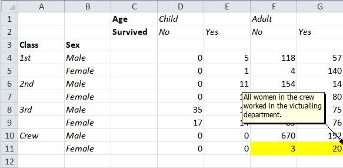

<style>
pre code, pre, code {
  white-space: pre !important;
  overflow-x: scroll !important;
  word-break: keep-all !important;
  word-wrap: initial !important;
}
</style>

```{r, include = FALSE}
knitr::opts_chunk$set(
  collapse = TRUE,
  comment = "#>",
  fig.path = "README-"
)
```

# tidyxl

[tidyxl](https://github.com/nacnudus/tidyxl) imports non-tabular data from Excel
files into R.  It exposes cell content, position, formatting and comments in a
tidy structure for further manipulation, especially by the
[unpivotr](https://github.com/nacnudus/unpivotr) package.  It supports the
xml-based file formats '.xlsx' and '.xlsm' via the embedded
[RapidXML](http://rapidxml.sourceforge.net) C++ library.  It does not support
the binary file formats '.xlsb' or '.xls'.

It also provides a function `xlex()` for tokenizing formulas.  See the
[vignette](https://nacnudus.github.io/tidyxl/articles/smells.html) for
details.  It is useful for detecting 'spreadsheet smells' (poor practice such as
embedding constants in formulas, or using deep levels of nesting), and for
understanding the dependency structures within spreadsheets.

## Mailing list

For bugs and/or issues, create a new issue on
[GitHub](https://github.com/nacnudus/tidyxl/issues) For other questions or
comments, please subscribe to the [tidyxl-devel mailing
list](https://groups.google.com/forum/#!forum/tidyxl-devel). You must be a
member to post messages, but anyone can read the archived discussions.

## Installation

```{r, echo = TRUE, eval = FALSE}
devtools::install_github("nacnudus/tidyxl")
```

## Examples

The package includes a spreadsheet, 'titanic.xlsx', which contains the following
pivot table:

```{r, echo = TRUE}
ftable(Titanic, row.vars = 1:2)
```

The multi-row column headers make this difficult to import.  A popular package
for importing spreadsheets coerces the pivot table into a dataframe. It treats
the second header row as though it were observations.

```{r, echo = TRUE}
titanic <- system.file("extdata/titanic.xlsx", package = "tidyxl")
readxl::read_excel(titanic)
```

[tidyxl](https://github.com/nacnudus/tidyxl) doesn't coerce the pivot table into
a data frame.  Instead, it represents each cell in its own row, where it
describes the cell's address, value and other properties.

```{r, echo = TRUE}
library(tidyxl)
x <- xlsx_cells(titanic)
dplyr::glimpse(x)
```

In this structure, the cells can be found by filtering.

```{r, echo = TRUE}
x[x$data_type == "character", c("address", "character")]
x[x$row == 4, c("address", "character", "numeric")]
```

Specific sheets can be requested using `xlsx_cells(file, sheet)`, and the names
of all sheets in a file are given by `xlsx_sheet_names()`.


### Formatting

The original spreadsheet has formatting applied to the cells.  This can also be
retrieved using [tidyxl](https://github.com/nacnudus/tidyxl), with the
`xlsx_formats()` function.



Formatting is available by using the columns `local_format_id` and
`style_format` as indexes into a separate list-of-lists structure.  'Local'
formatting is the most common kind, applied to individual cells.  'Style'
formatting is usually applied to blocks of cells, and defines several formats at
once.  Here is a screenshot of the styles buttons in Excel.


Formatting can be looked up as follows.

```{r, echo = TRUE}
# Bold
formats <- xlsx_formats(titanic)
formats$local$font$bold
x[x$local_format_id %in% which(formats$local$font$bold),
  c("address", "character")]

# Yellow fill
formats$local$fill$patternFill$fgColor$rgb
x[x$local_format_id %in%
  which(formats$local$fill$patternFill$fgColor$rgb == "FFFFFF00"),
  c("address", "numeric")]

# Styles by name
formats$style$font$name["Normal"]
head(x[x$style_format == "Normal", c("address", "character")])

# In-cell formatting is available in the `character_formatted` column as a data
# frame, one row per substring.
examples <- system.file("/extdata/examples.xlsx", package = "tidyxl")
xlsx_cells(examples)$character_formatted[77]
```

To see all the available kinds of formats, use `str(formats)`.

### Comments

Comments are available alongside cell values.

```{r, echo = TRUE}
x[!is.na(x$comment), c("address", "comment")]
```

### Formulas

Formulas are available, but with a few quirks.

```{r, echo = TRUE}
options(width = 120)
y <- xlsx_cells(examples, "Sheet1")
y[!is.na(y$formula),
  c("address", "formula", "is_array", "formula_ref", "formula_group",
    "error", "logical", "numeric", "date", "character")]
```

The top five cells show that the results of formulas are available as usual in
the columns `error`, `logical`, `numeric`, `date`, and `character`.

#### Shared formulas

Cells `A20` and `A21` illustrate how formulas are normalised before being
written to file, using the `formula_ref` and `formula_group` columns.  When
there is a group of cells whose formulas only differ by cell reference (e.g.
"=A1+1", "=A2+1", "=A3+1", etc.), only one formula in each group is written to
the file, so `tidyxl` infers what the formulas in the other cells in the group
must be, from their relative positions.

#### Array formulas

There are two kinds of array formulas: ones that compute over arrays, and ones
whose output is an array (of cells).

Both kinds are distinguished in
spreadsheet programs by curly braces, e.g. `{SUM(A19:A21*B19:B21)}`.  In
`tidyxl`, the curly braces are ommitted (as they are from the file itself), and
instead the `is_array` column has the value `TRUE`.

The first kind (those that compute over arrays) is illustrated by cell `A22`.

The second kind (those whose value is spread across an array of cells) is
illustrated by cells `A23` and `A24`.  The formula is only given in the top-left
cell (`A23`), which is also the only cell that describes the range of cells
containing the result, in the `formula-ref` column.  The results themselves are
stored in all relevant cells (`A23` and `A24`).  Unlike shared formulas, there
is no `formula_group` to associate the cells of an array formula's result.  If
you need to do identify those cells, use the
[cellranger](https://github.com/rsheets/cellranger) package and the
`formula_ref` column.

#### Formulas referring to other files

Cell `A25` contains a formula that refers to another file.  The `[1]` is an
index into a table of files.  The roadmap for
[tidyxl](https://github.com/nacnudus/tidyxl) includes de-referencing such
numbers.

#### Tokenizing formulas

The function `xlex()` separates formulas into tokens of different types, and
gives their depth within a nested formula.  Its name is a bad pun on 'Excel' and
'lexer'.  Try the [online demo](https://duncan-garmonsway.shinyapps.io/xlex/)
or install the more experimental [lexl](https://nacnudus.github.io/lexl/)
package to run `demo_lexl()` locally.

It is useful for detecting spreadsheet smells, which are poor practices in
spreadsheet design, such as deep nests of functions, or embedding
constants in formulas.

```{r, fig.width = 7, fig.height = 5}
x <- xlex("MIN(3,MAX(2,A1))")
x
```

See the [vignette](https://nacnudus.github.io/tidyxl/articles/smells.html) for
more examples and details.

### Named ranges

Names are imported with `xlsx_names()`.  Also called 'named formulas' and 'defined
names', these are usually used to name particular cells or ranges, making
formulas that refer to them more readable.  Ones that *are* ranges are identifed
by the `is_range` column (using `is_range()`), making it easier to match the
names to the cells returned by `xlsx_cells()` -- e.g. by using the
[`cellranger`](https://github.com/rsheets/cellranger) package.

When the scope of the name is within a particular sheet, rather than global, the
sheet name is given.

```{r}
xlsx_names(examples)
```

### Data validation rules

Data validation rules are imported with `xlsx_validation()`.  These rules
control what values may be entered into a cell, and are often used to create a
drop-down list in a cell.  Read the
[vignette](https://nacnudus.github.io/tidyxl/articles/data-validation-rules.html)
for details.

```{r}
xlsx_validation(examples)
```

## Philosophy

Information in in many spreadsheets cannot be easily imported into R.  Why?

Most R packages that import spreadsheets have difficulty unless the layout of
the spreadsheet conforms to a strict definition of a 'table', e.g.:

* observations in rows
* variables in columns
* a single header row
* all information represented by characters, whether textual, logical, or
  numeric

These rules are designed to eliminate ambiguity in the interpretation of the
information.  But most spreadsheeting software relaxes these rules in a trade of
ambiguity for expression via other media:

* proximity (other than headers, i.e. other than being the first value at the
  top of a column)
* formatting (colours and borders)

Humans can usually resolve the ambiguities with contextual knowledge, but
computers are limited by their ignorance.  Programmers are hampered by:

* their language's expressiveness
* loss of information in transfer from spreadsheet to programming library

Information is lost when software discards it in order to force the data into
tabular form.  Sometimes date formatting is retained, but mostly formatting
is lost, and position has to be inferred again.

[tidyxl](https://github.com/nacnudus/tidyxl) addresses the programmer's problems
by not discarding information.  It imports the content, position and formatting
of cells, leaving it up to the user to associate the different forms of
information, and to re-encode them in tabular form without loss.  The
[unpivotr](https://github.com/nacnudus/unpivotr) package has been developed to
assist with that step.

## Similar projects

[tidyxl](https://github.com/nacnudus/tidyxl) was originally derived from
[readxl](https://github.com/tidyverse/readxl) and still contains some of the
same code, hence it inherits the GPL-3 licence.
[readxl](https://github.com/tidyverse/readxl) is intended for importing tabular
data with a single row of column headers, whereas
[tidyxl](https://github.com/nacnudus/tidyxl) is more general, and less magic.

The [rsheets](https://github.com/rsheets) project of several R packages is in
the early stages of importing spreadsheet information from Excel and Google
Sheets into R, manipulating it, and potentially parsing and processing formulas
and writing out to spreadsheet files.  In particular,
[jailbreaker](https://github.com/rsheets/jailbreakr) attempts to extract
non-tabular data from spreadsheets into tabular structures automatically via
some clever algorithms.

[tidyxl](https://github.com/nacnudus/tidyxl) differs from
[rsheets](https://github.com/rsheets) in scope
([tidyxl](https://github.com/nacnudus/tidyxl) will never import charts, for
example), and implementation ([tidyxl](https://github.com/nacnudus/tidyxl) is
implemented mainly in C++ and is quite fast, only a little slower than
[readxl](https://github.com/tidyverse/readxl)).
[unpivotr](https://github.com/nacnudus/unpivotr) is a package related to
[tidyxl](https://github.com/nacnudus/tidyxl) that provides tools for unpivoting
complex and non-tabular data layouts using I not AI (intelligence, not
artificial intelligence).  In this way it corresponds to
[jailbreaker](https://github.com/rsheets/jailbreakr), but with a different
philosophy.
